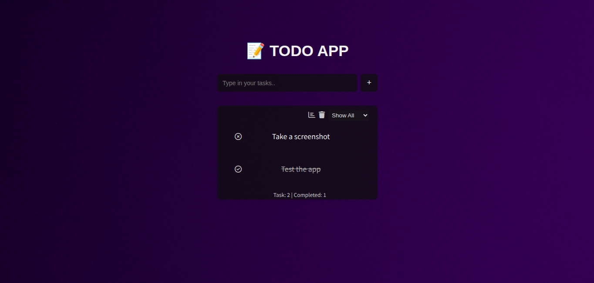

# Todo App (Full-Stack)

## 🚀 Overview
A full-stack Todo application with task management, and filtering features. Built to practice real-world CRUD operations and scalable architecture.

# ✨ Features
- Create, update, delete tasks
- Mark tasks as completed
- Filtering (All / Pending / Completed)


## 🛠 Tech Stack
- Frontend: React (Vite)
- Backend: Node.js, Express
- Database: MongoDB
- Deployment: Vercel (Frontend), Railway (Backend)

## 🔗 Live Demo
- Frontend: 
- Backend API: 

## ⚙️ Run Locally

```bash
git clone <repo-url>
cd todo-app
npm install
```

Create .env file:
```
MONGO_URI=your_mongodb_uri
PORT=5000
```

Run:
```bash
npm run dev
```

## 📸 Screenshots


## 📚 What I Learned
- Full-stack architecture (API → DB → UI)
- State management in React
- REST API design and integration
- Deployment workflow

## 🔮 Future Improvements
- Task categories/tags
- Due dates and reminders
- User authentication
- Dashboard analytics
- AI-powered task suggestions
